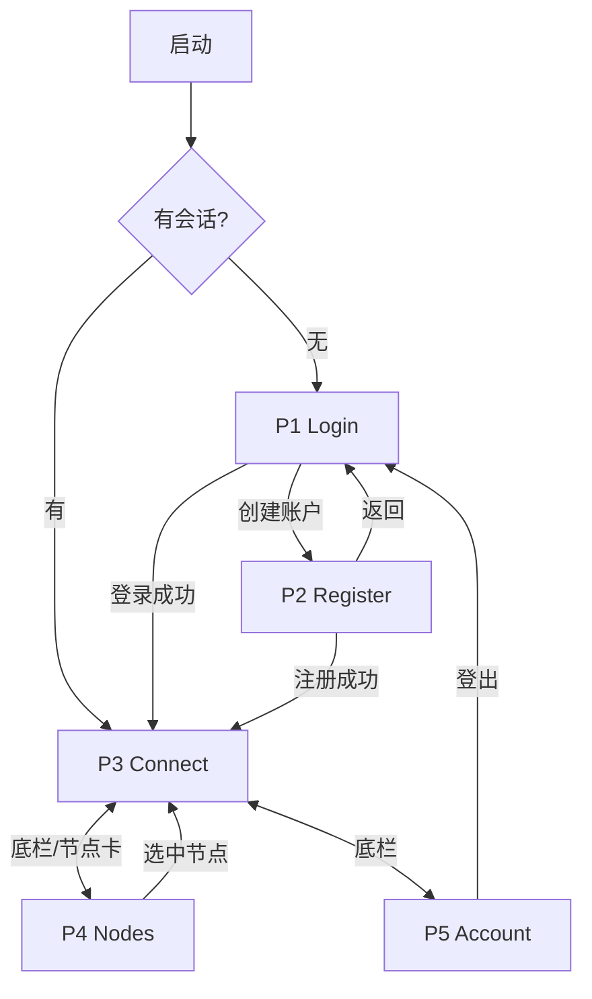
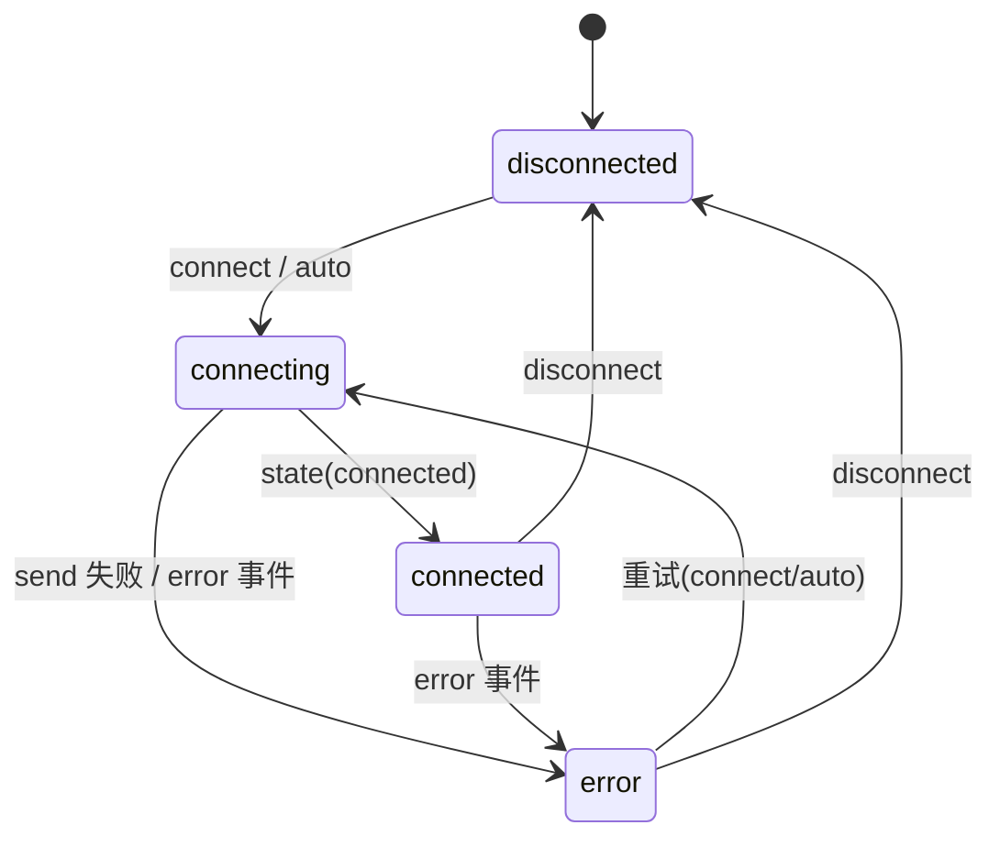

# PRD：mini_vpn iOS 客户端（mock-first 里程碑）

## 文档信息

| 字段 | 内容 |
|------|------|
| 文档标题 | mini_vpn iOS 客户端需求文档 |
| 文档编号 | PRD-2026-IOS-01 |
| 产品版本 | v0.1（mock-first） |
| 作者 | Sam |
| 创建日期 | 2026-06-24 |
| 最后更新 | 2026-06-24 |
| 状态 | 待评审 |
| 关联需求 | 设计稿：本会话内联 mockup（ios_auth / ios_connection / ios_nodes_logs / ios_account）；[ADR GUI 栈=C](../adr/2026-06-19-gui-stack-c-shared-rust-core.md)；[iOS plan](../plans/2026-06-19-ios-app.md)；[设计 spec](../specs/2026-06-12-frontend-contract-first-macos-design.md) |

## 修订历史

| 版本 | 日期 | 作者 | 变更说明 |
|------|------|------|----------|
| v0.1 | 2026-06-24 | Sam | 初始版本；Logs 移动端不做、change-password 本期不做、设备 revoke 做 |

---

## 一、问题陈述

mini_vpn 是多用户商业 VPN 服务。已建 macOS 客户端 + Go 后端（mock 已出），但**手机端是该品类的主要使用场景**，目前缺 iOS 客户端，用户无法在移动端登录、选节点、连接、查看订阅。本里程碑先用 `contracts/mock` 的假数据把 iOS 全链路 UI/状态机跑通（mock-first），真后端②/真隧道①延后接入，目的是**让 iOS UI 与契约一致、可独立验收，不被后端/NE 进度阻塞**。

> 使用率/转化等量化痛点：【待确认：缺线上数据，mock-first 阶段不设增长目标】。

## 二、目标

| 编号 | 目标描述 | 衡量指标 | 目标值 | 当前值 | 衡量时间 |
|------|----------|----------|--------|--------|----------|
| G-01 | iOS 跑通契约全链路 UI（登录→连接→选节点→账户） | 5 屏对 mock 全部可用、无 UI 阻断 | 100% | 0% | 本里程碑末 |
| G-02 | 逻辑层零重写、复用 apple-core | 新增逻辑仅 AuthViewModel | 仅 1 个新 VM | — | 本里程碑末 |
| G-03 | 服务层 mock→real 一行切换 | 切换点仅 `@main` 注入处 | 1 处 | — | 本里程碑末 |
| G-04 | 契约一致性 | iOS 解码全部 contract fixture 通过 | 0 解码失败 | — | 本里程碑末 |

## 三、非目标

| 非目标 | 排除原因 |
|--------|----------|
| Logs 日志屏 | 移动端不需要（产品决定） |
| change-password | auth 首版够用，留后续 |
| 支付/购买流程 | 契约仅保留只读字段 + not-implemented 占位（同 macOS） |
| 真 NEPacketTunnelProvider 隧道 | 需 Apple NetworkExtension entitlement（账号侧门槛），延后 |
| iPad 专属布局 | iPhone 优先；SwiftUI 同套未来顺带 |
| 第三方登录（Apple/Google） | 契约预留，本期不做 |

## 四、用户故事

```
用户角色：终端用户（已购买/试用的个人用户）

【P0 - 必须】
- US-01：作为用户，我想用邮箱+密码登录/注册，以便进入并使用服务
  - 验收：未登录启动 App 时，进入 Login；输入合法邮箱+密码点登录，进入主界面（Connect）
- US-02：作为用户，我想一键连接/断开 VPN，以便快速получить保护
  - 验收：在 Connect 屏点大开关，状态依次 connecting→connected，断开则回 disconnected
- US-03：作为用户，我想看到实时上下行速率与累计流量，以便确认隧道在工作
  - 验收：connected 后流量卡每秒刷新上下行速率与累计字节
- US-04：作为用户，我想手动选节点或自动优选，以便选到合适线路
  - 验收：在 Nodes 选某节点后，Connect 显示该节点；点"自动优选"则选中 selectBest 返回的节点
- US-05：作为用户，我想查看我的订阅与已绑定设备，以便了解服务状态
  - 验收：Account 显示 plan/status/到期日、设备数 X/上限

【P1 - 重要】
- US-06：作为用户，我想解绑某台设备，以便腾出设备配额
  - 验收：Account 设备行左滑出现"解绑"，确认后该设备从列表移除、计数-1
- US-07：作为用户，我想登出，以便切换账号或保护隐私
  - 验收：Account 点登出，清会话，回到 Login

【P2 - 期望】
- US-08：作为用户，我想看到连接异常/错误的明确反馈，以便知道发生了什么
  - 验收：连接失败时状态变 error（红），并有可读文案
```

## 五、非功能性需求

| 编号 | 类型 | 需求描述 | 衡量标准 |
|------|------|----------|----------|
| NFR-01 | 兼容性 | iOS 16+，iPhone 竖屏 | iOS 16 真机/模拟器可运行 |
| NFR-02 | 可用性 | 支持系统深/浅色模式 | 两种模式下文本/状态色均清晰 |
| NFR-03 | 无障碍 | 支持动态字体（Dynamic Type）；可交互元素有 accessibilityLabel；命中区 ≥44pt | VoiceOver 可读、最大字号不截断关键信息 |
| NFR-04 | 性能 | 流量刷新 1Hz 不卡顿；主线程不阻塞 | 列表/动效 60fps；FFI/IO 不在主线程（mock 阶段为内存读取） |
| NFR-05 | 一致性 | 字段全部来自 `contracts/`，camelCase↔snake_case 经 convertFromSnakeCase | 解码 fixture 0 失败 |
| NFR-06 | 可维护 | 服务层协议化，mock→real 仅改注入点 | 切换不动 View/VM |
| NFR-07 | 安全 | 密码输入掩码、不打印明文；token 内存持有（真实现换 Keychain） | 日志无明文凭证 |

---

## 六、功能需求（FR）

### 6.1 功能模块

| 功能模块 | 功能点 | 优先级 | 所属用户故事 | 备注 |
|----------|--------|--------|--------------|------|
| 鉴权 | 登录/注册/登出/会话 gate | P0 | US-01/US-07 | 新增 AuthViewModel |
| 连接 | 连接/断开/状态机/实时流量 | P0 | US-02/US-03/US-08 | 复用 ConnectionViewModel |
| 节点 | 列表/手动选/自动优选/接线到连接 | P0 | US-04 | 复用 NodeListViewModel |
| 账户 | 订阅展示/设备列表/解绑/登出 | P0/P1 | US-05/US-06/US-07 | 复用 AccountViewModel |
| 导航 | 会话 gate + 底 3-tab | P0 | US-01 | 新增 RootView |

功能结构：
```
iOS App
├── 鉴权前置（未登录）：Login / Register
└── 主界面（已登录，底 3-tab）
    ├── Connect（连接 + 流量）
    ├── Nodes（节点列表 + 选择）
    └── Account（订阅 + 设备 + 登出）
```

### 6.2 功能需求清单（US → FR 追溯）

| 需求ID | 需求描述 | 所属用户故事 | 优先级 | 验收标准（条件-操作-结果） | 对应界面 |
|--------|----------|--------------|--------|----------------------------|----------|
| FR-01 | 邮箱+密码登录，成功置会话态并进主界面 | US-01 | P0 | 输入合法邮箱+密码点登录→进 Connect | 7.1 |
| FR-02 | 注册（邮箱+密码+确认密码） | US-01 | P0 | 两次密码一致且合法点注册→进主界面 | 7.2 |
| FR-03 | 会话 gate：未登录→Auth，已登录→主界面 | US-01/US-07 | P0 | 启动/登出时按会话态切根视图 | 7.0 |
| FR-04 | 连接/断开 + 状态机 | US-02 | P0 | 点开关→connecting→connected；再点→disconnected | 7.3 |
| FR-05 | 实时流量（上下行速率+累计） | US-03 | P0 | connected 后流量卡 1Hz 刷新 | 7.3 |
| FR-06 | 节点列表（shared+dedicated 全字段） | US-04 | P0 | 进 Nodes 显示 mock 全部节点 | 7.4 |
| FR-07 | 手动选节点 + 选中态 | US-04 | P0 | 点某行→该行选中、其余取消 | 7.4 |
| FR-08 | 自动优选（selectBest） | US-04 | P0 | 点"自动优选"→选中 selectBest.nodeId | 7.4 |
| FR-09 | 选中节点接线到连接 | US-04 | P0 | 选中 X 后回 Connect，连接发 connect(nodeId=X)/auto | 7.3/7.4 |
| FR-10 | 订阅展示（只读） | US-05 | P0 | Account 显示 plan/status/到期/上限 | 7.5 |
| FR-11 | 设备列表 + 计数 | US-05 | P0 | Account 显示设备 + X/上限 | 7.5 |
| FR-12 | 设备解绑（左滑 revoke） | US-06 | P1 | 左滑某设备点解绑确认→移除、计数-1 | 7.5 |
| FR-13 | 登出 | US-07 | P1 | 点登出→清会话→回 Login | 7.5 |
| FR-14 | 连接错误态展示 | US-08 | P2 | send 失败/error 事件→状态 error（红）+ 文案 | 7.3 |

---

## 七、界面功能详细说明

### 7.0 页面总览与全局流转

**页面清单**

| 编号 | 页面名称 | 类型 | 入口 | 主要去向 |
|------|----------|------|------|----------|
| P1 | Login | 全屏（未登录） | 启动且无会话 | 登录成功→主界面；→Register |
| P2 | Register | 全屏（未登录） | Login「创建账户」 | 注册成功→主界面；返回→Login |
| P3 | Connect | Tab1（已登录） | 登录后默认 tab | →Nodes（点节点卡） |
| P4 | Nodes | Tab2（已登录） | 底栏 Nodes | 选节点后回 Connect |
| P5 | Account | Tab3（已登录） | 底栏 Account | 登出→Login |

**全局页面流转图**



**连接状态机**（对象：VPN 连接）



状态 × 颜色：disconnected 灰 / connecting 橙 / connected 绿 / error 红。

---

### 7.1 Login（登录）

**界面基本信息**

| 项目 | 内容 |
|------|------|
| 功能描述 | 邮箱+密码登录 |
| 用户场景 | 启动 App 且无有效会话 |
| 优先级 | P0 |
| 前置条件 | 无会话 |
| 入口 | 启动（会话 gate 判定无会话）|
| 所属用户故事 / FR | US-01 / FR-01 |
| 原型 | 会话内联 mockup `ios_auth_mockup`（左屏）|

**原型标注**：①邮箱输入 ②密码输入（含👁显隐）③登录按钮 ④「创建账户」链接。

**界面元素清单表**

| 序号 | 名称 | 类型 | 必填项 | 默认值 | 数据来源 | 前置条件 | 业务规则 |
|------|------|------|--------|--------|----------|----------|----------|
| 1 | 邮箱 | Input | 是 | 空 | 用户输入 | - | 1. 校验：邮箱格式（含 @ 与域名）<br/>2. 组件：keyboardType=emailAddress、autocapitalization=none、autocorrection=off、textContentType=username、allowClear<br/>3. 异常：为空提示「请输入邮箱」；格式错提示「邮箱格式不正确」 |
| 2 | 密码 | Input(secure) | 是 | 空 | 用户输入 | - | 1. 校验：minLength 6<br/>2. 组件：isSecureTextEntry，尾部👁切换明/密文；textContentType=password<br/>3. 异常：为空提示「请输入密码」 |
| 3 | 登录 | Button | - | enabled | - | - | 1. enabled 条件：邮箱与密码均非空（格式错在提交时校验）<br/>2. 点击：调 `backend.login(email,password)`；loading 期间按钮转圈并禁用防重复<br/>3. 成功：写入会话 token，切到主界面（Connect）<br/>4. 失败：保持本屏，顶部/字段下红字提示错误（如「邮箱或密码错误」）；BackendError.unauthorized→「邮箱或密码错误」，transport→「网络异常，请重试」 |
| 4 | 创建账户 | Link/Button | - | - | - | - | 点击跳转 Register（push） |

**交互流程补充**
- 主流程：输入邮箱→输入密码→点登录→loading→成功进 Connect。
- 异常流程：格式不符→字段下红字、不发请求；接口失败→停留本屏+错误文案，可重试。
- 状态流转（登录按钮）：`enabled —(点击)→ loading —(成功)→ 跳转 / (失败)→ enabled`。

**页面级状态**
- 空态：不适用（表单页）。
- 加载态：登录请求中按钮 loading、表单禁用。
- 错误态：接口失败顶部红字，输入保留，可重试。
- 成功态：无 Toast，直接切主界面（导航即反馈）。

**入口与出口**：从启动 gate 进入；登录成功→Connect；点创建账户→Register。

---

### 7.2 Register（注册）

**界面基本信息**

| 项目 | 内容 |
|------|------|
| 功能描述 | 邮箱+密码+确认密码注册 |
| 优先级 | P0 |
| 前置条件 | 无会话 |
| 入口 | Login「创建账户」|
| 所属用户故事 / FR | US-01 / FR-02 |
| 原型 | `ios_auth_mockup`（右屏）|

**原型标注**：①返回 ②邮箱 ③密码 ④确认密码（不一致红边+提示）⑤注册按钮。

**界面元素清单表**

| 序号 | 名称 | 类型 | 必填项 | 默认值 | 数据来源 | 前置条件 | 业务规则 |
|------|------|------|--------|--------|----------|----------|----------|
| 1 | 返回 | Button | - | - | - | - | 点击 pop 回 Login，不保存输入 |
| 2 | 邮箱 | Input | 是 | 空 | 用户输入 | - | 规则同 7.1-① |
| 3 | 密码 | Input(secure) | 是 | 空 | 用户输入 | - | 1. 校验：minLength 6<br/>2. isSecureTextEntry，textContentType=newPassword<br/>3. 异常：为空提示「请输入密码」 |
| 4 | 确认密码 | Input(secure) | 是 | 空 | 用户输入 | - | 1. 校验：必须与密码完全一致<br/>2. 异常：不一致时字段红边 + 「两次输入的密码不一致」 |
| 5 | 注册 | Button | - | disabled | - | - | 1. disabled 默认；enabled 条件：三项非空且确认密码==密码<br/>2. 点击：调 `backend.register(email,password)`；loading 防重复<br/>3. 成功：写会话→进主界面<br/>4. 失败：停留+错误文案（如「邮箱已注册」）|

**交互流程补充**
- 主流程：输入三项→两次密码一致→注册按钮 enabled→点击→成功进主界面。
- 异常流程：密码不一致→④红字、⑤保持 disabled；接口失败→错误文案可重试。
- 状态流转（注册按钮）：`disabled —(三项非空且两次一致)→ enabled —(点击)→ loading —(成功)→ 跳转 / (失败)→ enabled`。

**页面级状态**
- 加载态：注册中按钮 loading、表单禁用。
- 错误态：接口失败顶部红字，输入保留。
- 成功态：直接切主界面。

**入口与出口**：从 Login 进入；成功→Connect；返回→Login。

---

### 7.3 Connect（连接 + 流量）

**界面基本信息**

| 项目 | 内容 |
|------|------|
| 功能描述 | 一键连接/断开，展示状态与实时流量、当前选中节点 |
| 优先级 | P0 |
| 前置条件 | 已登录 |
| 入口 | 登录后默认 tab / 底栏 Connect |
| 所属用户故事 / FR | US-02/US-03/US-08 / FR-04/05/09/14 |
| 原型 | `ios_connection_mockup` |

**原型标注**：①大圆连接开关（含状态色）②状态文案 ③当前节点卡（可点→Nodes）④下行流量卡 ⑤上行流量卡。开关存在**状态扭转**（灰/橙/绿/红）。

**界面元素清单表**

| 序号 | 名称 | 类型 | 必填项 | 默认值 | 数据来源 | 前置条件 | 业务规则 |
|------|------|------|--------|--------|----------|----------|----------|
| 1 | 连接开关 | Button(toggle) | - | disconnected(灰) | ConnectionViewModel.state | - | 1. 点击：未连接→`connect(选中nodeId)`，无选中则 `auto`；已连接→`disconnect`<br/>2. 状态色：disconnected 灰 / connecting 橙(转圈) / connected 绿 / error 红<br/>3. connecting 期间禁止重复点击（防抖）<br/>4. 异常：send 抛错→state=error、③下方/状态区显示错误文案 |
| 2 | 状态文案 | Text | - | "未连接" | ConnectionViewModel.state | - | 文案映射：未连接/连接中…/已连接/连接出错；颜色同状态色 |
| 3 | 当前节点卡 | Card(Button) | - | "自动优选" | NodeListViewModel.selectedNode（无则展示 auto） | - | 1. 显示 region·city + 来源（手动/自动·最低延迟）+ 延迟 + tier/IP<br/>2. 点击：切到 Nodes（FR-09 选中态共享）<br/>3. 空态：未选时显示「自动优选」占位 |
| 4 | 下行流量 | Metric | - | 0 | ControlEvent.stats(downBps,downBytes) | state==connected | 1. 速率格式：<1000Kbps 显示「N Kbps」，≥1000 显示「N.N Mbps」<br/>2. 累计字节：「N.N MB」<br/>3. 未连接显示 0；connected 后 1Hz 刷新 |
| 5 | 上行流量 | Metric | - | 0 | ControlEvent.stats(upBps,upBytes) | state==connected | 规则同④（上行字段） |

**交互流程补充**
- 主流程：点开关→connecting(橙,转圈)→connected(绿)→流量卡开始 1Hz 刷新。
- 断开：点开关→disconnect→disconnected(灰)，流量归零/停更。
- 选节点联动：在 Nodes 选 X→回 Connect，③显示 X；下次连接发 connect(nodeId=X)。
- 异常流程：send 抛错或收到 error 事件→①②变红、显示错误文案；可再次点击重试。
- 状态流转：见 7.0 状态机。

**页面级状态**
- 空态：未选节点时③显示「自动优选」。
- 加载态：connecting 时①转圈、禁点。
- 错误态：error 状态红色 + 文案，开关可重试。
- 成功态：connected 绿色 + 流量实时跳动（即时反馈）。

**入口与出口**：底栏进入；点③→Nodes。

---

### 7.4 Nodes（节点列表 + 选择）

**界面基本信息**

| 项目 | 内容 |
|------|------|
| 功能描述 | 展示可用节点，支持手动选与自动优选，选中结果驱动连接 |
| 优先级 | P0 |
| 前置条件 | 已登录 |
| 入口 | 底栏 Nodes / Connect 节点卡 |
| 所属用户故事 / FR | US-04 / FR-06/07/08/09 |
| 原型 | `ios_nodes_logs_mockup`（左屏）|

**原型标注**：①自动优选按钮 ②节点行（shared，未选）③节点行（选中，蓝高亮+对勾）④节点行（dedicated，带标签）。

**界面元素清单表**

| 序号 | 名称 | 类型 | 必填项 | 默认值 | 数据来源 | 前置条件 | 业务规则 |
|------|------|------|--------|--------|----------|----------|----------|
| 1 | 自动优选 | Button | - | enabled | - | - | 1. 点击：调 `backend.selectBest()`，将返回 nodeId 设为选中<br/>2. loading 期间转圈禁用<br/>3. 失败：Toast/行内提示「优选失败，请重试」 |
| 2 | 节点行 | Cell | - | - | backend.listNodes()（SharedNode/DedicatedNode） | - | 1. 展示：`region · city`（主）+ 副标题：shared→「Shared · {tier}」，dedicated→「{staticIp} · {label}」并带 `dedicated` 标签<br/>2. 右侧：`latencyMs ms`；shared 另显 `load %`<br/>3. 选中态：选中行蓝色高亮 + 对勾（ti-circle-check），未选灰圈<br/>4. 点击：设为 selectedNode（单选，互斥）<br/>5. dedicated 若 expiresAt 已过期：置灰不可选 + 标「已过期」【待确认：过期是否仍展示】 |
| 3 | 列表 | List | - | - | listNodes | - | 1. 加载态：骨架/转圈<br/>2. 空态：无节点显示「暂无可用节点」<br/>3. 错误态：加载失败显示「加载失败，下拉重试」+ 下拉刷新<br/>4. 支持下拉刷新重新拉取 |

**交互流程补充**
- 主流程（手动）：进入→列表加载→点某行→该行选中（互斥）→返回 Connect 生效。
- 主流程（自动）：点①→selectBest→对应行选中。
- 联动：选中态写入 NodeListViewModel.selectedNode，Connect 的③与连接命令共享（FR-09）。
- 异常流程：listNodes/selectBest 失败→错误态/Toast，可重试。

**页面级状态**
- 空态：「暂无可用节点」。
- 加载态：列表骨架/转圈；①loading 转圈。
- 错误态：「加载失败，下拉重试」。
- 成功态：选中行高亮即反馈（无额外 Toast）。

**入口与出口**：底栏/Connect 节点卡进入；选中后用户切回 Connect（tab 切换）。

---

### 7.5 Account（订阅 + 设备 + 登出）

**界面基本信息**

| 项目 | 内容 |
|------|------|
| 功能描述 | 展示订阅与设备，支持设备解绑与登出 |
| 优先级 | P0/P1 |
| 前置条件 | 已登录 |
| 入口 | 底栏 Account |
| 所属用户故事 / FR | US-05/06/07 / FR-10/11/12/13 |
| 原型 | `ios_account_mockup` |

**原型标注**：①订阅卡（plan/status/到期，只读）②设备区头（计数 X/上限）③设备行（左滑出解绑）④登出按钮。

**界面元素清单表**

| 序号 | 名称 | 类型 | 必填项 | 默认值 | 数据来源 | 前置条件 | 业务规则 |
|------|------|------|--------|--------|----------|----------|----------|
| 1 | 订阅卡 | Card(只读) | - | - | backend.getSubscription()（plan/status/expiresAt/deviceLimit） | - | 1. 行：Plan={plan}；Status={status} 用色 pill（active 绿 / expired 灰红）；Expires={expiresAt 格式化为本地日期}<br/>2. expiresAt 为空时显示「—」（如终身/异常）<br/>3. 纯展示，不可编辑 |
| 2 | 设备区头 | Text | - | - | listDevices()（count, deviceLimit） | - | 显示「{devices.count} of {deviceLimit}」 |
| 3 | 设备行 | Cell(swipe) | - | - | listDevices().devices（name/platform/lastSeenAt） | - | 1. 展示：name（主）+「{platform} · {lastSeenAt 相对时间}」；当前设备标「this device」<br/>2. 左滑露出「解绑」(红)；点击弹确认「解绑后该设备需重新登录」→确认调 `backend.revokeDevice(id)`<br/>3. 成功：行移除、②计数-1<br/>4. 失败：行复位 + Toast「解绑失败，请重试」<br/>5. 边界：当前设备解绑【待确认：是否允许解绑当前设备/解绑后是否登出】 |
| 4 | 登出 | Button | - | enabled | - | - | 1. 点击：弹确认「确定登出？」→确认调 `backend.logout()` 并清本地会话 token<br/>2. 成功：切回 Login<br/>3. 失败：仍清本地会话并回 Login（登出以本地为准）|

**交互流程补充**
- 主流程：进入→并发加载订阅+设备→展示。
- 解绑：左滑设备→解绑→确认→接口成功→列表移除、计数-1。
- 登出：点登出→确认→清会话→回 Login。
- 异常流程：加载失败→错误态可重试；解绑失败→行复位+Toast。

**页面级状态**
- 空态：设备列表为空显示「暂无设备」（理论至少含当前设备）。
- 加载态：订阅/设备加载中骨架。
- 错误态：加载失败「加载失败，下拉重试」。
- 成功态：解绑后列表即时更新（即反馈）。

**入口与出口**：底栏进入；登出→Login。

---

## 八、数据需求

**核心实体（字段权威来自 `contracts/mock`，camelCase ↔ snake_case 经 convertFromSnakeCase）**

| 实体 | 字段 | 类型 | 约束/说明 |
|------|------|------|-----------|
| TokenPair | accessToken / refreshToken / tokenType / expiresIn | String/String/String/Int | tokenType=Bearer；expiresIn 秒 |
| Subscription | plan / status / expiresAt? / deviceLimit | String/String/String?/Int | status∈{active,expired} |
| Device | id / name / platform / lastSeenAt / createdAt | String×5 | platform 如 macos/ios |
| SharedNode | id / kind / region / city / latencyMs / load / tier | …Int/Double/String | kind=shared |
| DedicatedNode | id / kind / region / city / label / staticIp / expiresAt / latencyMs / load | … | kind=dedicated；归属当前用户 |
| SelectBestResponse | nodeId / reason | String/String | 自动优选返回 |
| TrafficStats（①事件） | upBps / downBps / upBytes / downBytes | Int×4 | stats 事件 |
| LogLine（①事件，iOS 不展示） | level / message / ts | String/String/Date | 移动端不渲染 |

**会话/本地态**：会话 token（内存持有，登出清除；真实现换 Keychain）；selectedNode（内存，跨 tab 共享）。

## 九、接口需求

**② App ↔ 云端（BackendService 协议，mock 实现读 fixture）**

| 接口 | 用途 | 关键字段 | 错误 |
|------|------|----------|------|
| register / login | 注册/登录 | in: email,password；out: TokenPair | unauthorized / transport |
| refresh | 刷新 token（自动，无 UI） | in: refreshToken；out: TokenPair | unauthorized |
| logout | 登出 | - | （失败仍本地清会话） |
| getSubscription | 订阅 | out: Subscription | transport |
| listDevices | 设备列表 | out: (devices,deviceLimit) | transport |
| revokeDevice | 解绑 | in: id | transport |
| listNodes | 节点列表 | out: [Node] | transport |
| selectBest | 自动优选 | out: SelectBestResponse | transport |
| purchaseSubscription / purchaseDedicatedIp | 购买（占位） | - | **notImplemented**（本期不接 UI） |

**① 本机控制（ControlService 协议，mock 状态机）**

- 命令：`connect(nodeId)` / `disconnect` / `selectNode(nodeId)` / `auto`（`async throws`）。
- 事件流：`state(ConnectionState)` / `stats(TrafficStats)` / `log(LogLine)` / `error(String)`。
- iOS 消费 state→开关/文案、stats→流量卡、error→错误态；log 不展示。

## 十、上线计划（内部里程碑）

| 里程碑 | 交付物 | 状态 |
|--------|--------|------|
| PRD 评审 | 本文档 | 待评审 |
| 设计交付 | 5 屏 mockup + design spec | 设计稿已出，spec 待落 |
| Phase 1 共享就绪 | apple-core + iOS 平台 | ✅ 已完成 |
| Phase 3 模块实现 | M1 Auth→M6 Account（TDD） | 待开始 |
| Phase 4 外壳 + sim 冒烟 | ios-app 可在模拟器跑 mock | 待开始 |

- 回滚方案：mock-first 不涉线上，里程碑内代码可直接回退 commit。
- 上线验收：见 G-01~G-04 + 各 FR 验收标准。

## 十一、成功指标

| 指标类型 | 指标名称 | 目标值 | 当前值 | 衡量周期 | 数据来源 |
|----------|----------|--------|--------|----------|----------|
| 领先指标 | 契约链路可用屏数 | 5/5 | 0 | 里程碑末 | 手测 + swift test |
| 领先指标 | 解码 fixture 失败数 | 0 | — | 里程碑末 | 单测 |
| 滞后指标 | 真后端切换改动点 | 1 处 | — | 接 ② 时 | 代码评审 |

> 增长/转化类滞后指标（留存/付费转化）：【待确认：mock-first 阶段不设，接真后端+上线后再补】。

## 十二、数据埋点

> 本里程碑 mock-first、无真实用户，**暂不做埋点**。接真后端/上线前补：关键事件（登录成功、连接成功、选节点、解绑、登出）+ 漏斗（启动→登录→连接成功）。北极星候选：日活连接成功用户数。【待确认】

## 十三、开放问题

| 编号 | 问题 | 领域 | 负责人 | 期望答复 | 状态 |
|------|------|------|--------|----------|------|
| Q-01 | dedicated 节点过期是否仍展示/置灰逻辑 | 产品/设计 | Sam | 进 M4 前 | 待回复 |
| Q-02 | 是否允许解绑「当前设备」，解绑后是否强制登出 | 产品 | Sam | 进 M6 前 | 待回复 |
| Q-03 | mock 阶段是否需要"记住登录态"持久化（重启免登录），还是每次启动回 Login | 产品/研发 | Sam | 进 M1 前 | 待回复 |
| Q-04 | 上线/埋点/增长指标 | 产品 | Sam | 接真后端时 | 待回复 |

## 十四、依赖与风险

**依赖项**

| 依赖方 | 依赖内容 | 当前状态 | 风险等级 |
|--------|----------|----------|----------|
| apple-core（共享 Swift 包） | models/services/VMs/mock | 已就绪（Phase 1 完成） | 低 |
| contracts/mock | fixture 数据 | 已出 | 低 |
| 真后端 ② / 真 NE ① | 切真实现 | 延后 | 中（本里程碑不阻塞） |
| Apple NetworkExtension entitlement | 真隧道 | 账号侧未开 | 中（延后项） |

**风险识别**

| 风险描述 | 影响 | 概率 | 等级 | 应对 |
|----------|------|------|------|------|
| 选中节点未真接线（macOS 旧坑） | 选节点无效 | 中 | 中 | FR-09 明确接线 + 测试覆盖 |
| AuthViewModel token 内存版与真 ② 注入不一致 | 切真返工 | 中 | 中 | 协议化 + 内存版隔离在 mock，真实现换 Keychain 注入 |
| 实时流量 1Hz 在弱机卡顿 | 体验 | 低 | 低 | stats 节流 + 主线程仅渲染 |

## 十五、附录

**术语**：① local-control（GUI↔本机 core 控制面）；② backend（App↔云端）；selectBest（自动优选）。

**附件清单**

| 编号 | 附件名称 | 类型 | 关联界面 |
|------|----------|------|----------|
| A-01 | ios_auth_mockup | 设计稿（内联） | 7.1 / 7.2 |
| A-02 | ios_connection_mockup | 设计稿（内联） | 7.3 |
| A-03 | ios_nodes_logs_mockup（Logs 部分不采用） | 设计稿（内联） | 7.4 |
| A-04 | ios_account_mockup | 设计稿（内联） | 7.5 |

---

**文档结束**
